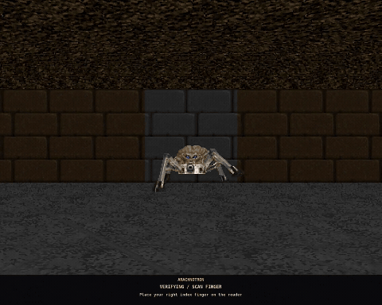
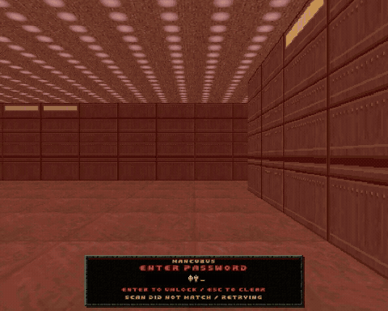
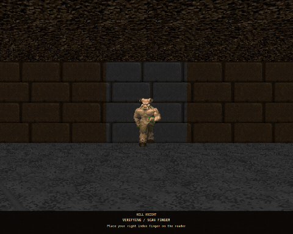

# Doom lock

A Doom-themed X11 screen locker, based on [i3lock 2.16](https://github.com/i3/i3lock/tree/2.16).
The camera retreats through a textured maze while a random monster follows you.
Typing hits the monster. A correct password kills it, a fingerprint match fires
a BFG into it, and a wrong password melts the scene into a red death screen.
Success ends with the classic column melt revealing your live desktop.

## See it

The maze runs at 30 FPS; the GIFs below run at 12 FPS to keep downloads small.
These recordings use a synthetic desktop and simulated authentication on an
isolated Xvfb display. They show the actual renderer and lock window.

Walking through the maze:



Password hits, a failed attempt, and a successful retry:



Fingerprint BFG kill and desktop reveal:



## Requirements

This fork targets **Linux and X11**. The installer currently supports
Debian/Ubuntu-style PAM configurations with an initial optional fingerprint
alternative followed by Unix or SSS password alternatives and the generated
deny/permit rules. Other PAM layouts, password-only common-auth layouts, and
Wayland sessions are unsupported by this installer.

You supply your own Doom II-compatible WAD. No WADs, extracted sprites, textures,
or game binaries are included in this repository or its executable. The GIFs
are rendered demonstrations. Both IWAD and complete standalone PWAD files work;
Doom I files and partial mod PWADs are unsupported. The maze is generated rather
than loaded from the game's map geometry.

You also need system `i3lock`, Python 3.9 or newer, and a supported fingerprint
reader enrolled through fprintd. System i3lock supplies `/etc/pam.d/i3lock`.
Doom lock keeps password and fingerprint verification in separate PAM workers.
It never edits system PAM files.

## Build

On Debian/Ubuntu, install the compiler, development libraries, and test tools:

```sh
git clone https://github.com/dustyhair/doom-lock.git
cd doom-lock
sudo apt-get update
sudo apt-get install -y --no-install-recommends $(cat ci/packages.txt)
meson setup build/meson --buildtype=release
meson compile -C build/meson
```

The binary is `build/meson/i3lock-doom`. Building requires no game content.
For a PNG-only build, add `-Dwad_assets=false` to the Meson setup command.

There is also a local header build for machines whose runtime libraries are
already installed. It downloads development packages into the checkout without
installing them system-wide:

```sh
python3 tools/bootstrap-deps.py
python3 tools/build-local.py
```

That binary is `build/i3lock-doom`. Add `--without-wad` for PNG-only support.
The script honors `CC` and `CFLAGS` and can also use installed development headers.
See [DOOM-LOCK.md](DOOM-LOCK.md) for dependencies and optional PNG extraction.

## Set up authentication and install

Install your distribution's system locker and fingerprint support if needed:

```sh
sudo apt-get install i3lock fprintd libpam-fprintd
fprintd-enroll
```

Enable optional fingerprint authentication through your distribution's PAM
configuration tools, such as `sudo pam-auth-update`. Keep password authentication
enabled. The installer accepts the fingerprint/password alternative layout
described above and checks it before installing the launcher. It preserves other
service and login rules, including password failure delays.

Check the existing policy, then install using your WAD's actual location:

```sh
python3 tools/prepare-pam.py build/pam-check
python3 tools/install-local.py --binary build/meson/i3lock-doom --wad /path/to/DOOM2.WAD
```

For the local header build, omit `--binary`. Quote WAD paths that contain spaces.
`--wad` stores an absolute path in `~/.config/doom-lock/wad`; it does not copy
your WAD or extract artwork. Unsupported policies stop installation. At runtime,
policy or content loading failures make the launcher fall back to system i3lock.

Launch it with:

```sh
~/.local/bin/lock-screen.sh
```

Point your desktop's lock shortcut or menu at that command. For i3, a binding
can be:

```i3
bindsym $mod+l exec --no-startup-id ~/.local/bin/lock-screen.sh
```

The installer puts the binary in `~/.local/bin/i3lock-doom` and helpers in
`~/.local/share/doom-lock`. It backs up an existing `lock-screen.sh` there before
replacing it. It does not change your desktop's shortcuts or idle settings.
To restore your previous launcher, copy the saved `lock-screen.sh.before-doom-*`
file back to `~/.local/bin/lock-screen.sh`.

You can override the saved content selection for one invocation:

```sh
DOOM_LOCK_WAD=/another/path/DOOM2.WAD ~/.local/bin/lock-screen.sh
```

## Checks and development

CI compiles with GCC and Clang, with WAD support enabled and disabled. It uses
generated test artwork, so CI needs no game files. Authentication and animation
tests run on their own Xvfb display using a test-only PAM stub. They do not check
your password, talk to your physical sensor, or lock your current desktop.

To run the same checks in an isolated container:

```sh
docker build -t doom-lock-check -f ci/Dockerfile .
docker run --rm --network none -v "$PWD:/src" doom-lock-check
```

Use a clean checkout for this command. `ci/check.sh` creates `build/meson` and
expects it not to exist. Add `-e CC=clang` or `-e DOOM_CI_WAD=false` to select
another build variant. See [the architecture](docs/architecture.md),
[review notes](docs/review.md), and [contributing guide](.github/CONTRIBUTING.md)
for module boundaries and focused checks.

## Credits and license

The code retains i3lock's [BSD 3-Clause license](LICENSE) and attribution to
Michael Stapelberg and contributors. Doom names and the game artwork visible in
the demos belong to their respective owners; the code license does not cover
that artwork. Each user supplies their own game content.

Animation sequences and melt behavior reference
[id Software's released Doom source](https://github.com/id-Software/DOOM).
This is an independent personal project, unaffiliated with i3 or id Software.
